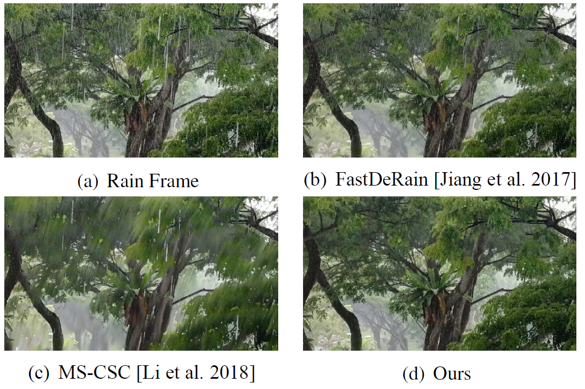

## Self-Learned Video Rain Streak Removal: When Cyclic Consistency Meets Temporal Correspondence (CVPR'2020)

[Wenhan Yang](https://flyywh.github.io/index.html), [Robby T. Tan](https://tanrobby.github.io/pub.html), [Shiqi Wang](https://www.cs.cityu.edu.hk/~shiqwang/), and [Jiaying Liu](http://www.icst.pku.edu.cn/struct/people/liujiaying.html) 

[[Paper Link]](http://openaccess.thecvf.com/content_CVPR_2020/papers/Yang_Self-Learning_Video_Rain_Streak_Removal_When_Cyclic_Consistency_Meets_Temporal_CVPR_2020_paper.pdf) [[Project Page]](https://github.com/flyywh/CVPR-2020-Self-Rain-Removal) [[Slides]]()(TBA)[[Video]]()(TBA) (CVPR'2020 Poster)

### Abstract

In this paper, we address the problem of rain streaks removal in video by developing a self-learned rain streak removal method, which does not require any clean groundtruth images in the training process. The method is inspired by fact that the adjacent frames are highly correlated and can be regarded as different versions of identical scene, and rain streaks are randomly distributed along the temporal dimension. With this in mind, we construct a two-stage Self-Learned Deraining Network (SLDNet) to remove rain streaks based on both temporal correlation and consistency. In the first stage, SLDNet utilizes the temporal correlations and learns to predict the clean version of the current frame based on its adjacent rain video frames. In the second stage, SLDNet enforces the temporal consistency among different frames. It takes both the current rain frame and adjacent rain video frames to recover the structural details. The first stage is responsible for reconstructing main structures, and the second stage is responsible for extracting structural details. We build our network architecture with two sub-tasks, i.e. motion estimation and rain region detection, and optimize them jointly. Our extensive experiments demonstrate the effectiveness of our method, offering better results both quantitatively and qualitatively.

#### If you find the resource useful, please cite the following :- )

```
@InProceedings{Yang_2020_CVPR,
author = {Yang, Wenhan and Wang, Shiqi and Fang, Yuming and Wang, Yue and Liu, Jiaying},
title = {From Fidelity to Perceptual Quality: A Semi-Supervised Approach for Low-Light Image Enhancement},
booktitle = {IEEE/CVF Conference on Computer Vision and Pattern Recognition (CVPR)},
month = {June},
year = {2020}
}
```
 
## Prerequisites
- Linux or macOS
- Python 3
- NVIDIA GPU + CUDA cuDNN
- PyTorch 0.4

## Installation
1. Clone this repo;
2. Install PyTorch and dependencies from http://pytorch.org;
3. Download FLowNet V2.0 from https://pan.baidu.com/s/14xPBvYcnGjAJ2adsQOVKhA(extracted code: 3is9). 
   Put the file FlowNet2_checkpoint.pth.tar into SLDNet_code/pretrained_models;
4. Download NTURain Dataset (Only including b1_Rain) from https://pan.baidu.com/s/1nsBl6uhj-MWVgr1uBcsy1w(extraced code:rufg). 
   For other sequences, please download them from https://github.com/hotndy/SPAC-SupplementaryMaterials. 
   Unzip b1_Rain.zip and put the file into SLDNet_code/data_NTU/train/b1_Rain/ and SLDNet_code/data_NTU/test/b1_Rain/.

## Train

## Test

## Contact

If you have questions, you can contact `yangwenhan@pku.edu.cn`.
